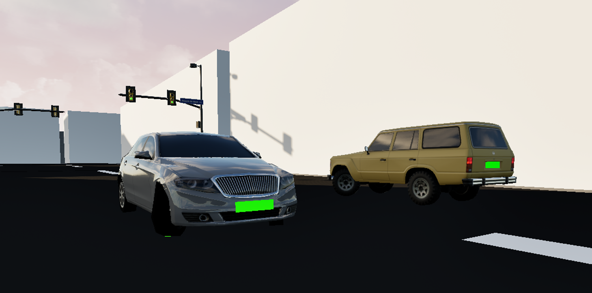

# AI Cars

In this page there will be a detailed explanation of the logic behind the ai drivers. The car models of the ai drivers are part of the lower poly model pack [Background Cars by Iyoshko](https://www.fab.com/listings/e4a141a4-2ee0-411a-b807-844c927eb4e3). These cars are using an [AI Controller](https://dev.epicgames.com/documentation/en-us/unreal-engine/ai-controllers-in-unreal-engine), which contains the main functions and calculations of each car, and box colliders. Currently all the AI cars are spawned at the start of the game, meaning there is no dynamic spawning/despawning of cars.

## Actions

These are the main functions of each car in more detail.

### Automatic Movement

The movement of each car is done using splines, which exist in each road. More specifically all of the [roads]() in the application contain spline components and collision boxes. After a car hits a collision box, it is assigned a new spline which is the new movement direction. The throttle, brake, steering inputs are calculated using the current position of the car in the spline and an estimated next position.

### Obstacle Detection

Each car has a box collider in the front of it, which changes its shape depending on the speed of the vehicle. An increase in the speed increases the size of the collider. Using this the car can detect obstacles in front of it, like other cars or pedestrians, and adjust its speed.

### Traffic Light Logic

Traffic lights are important elements in the car logic. The traffic light constantly changes states during the simulation. In order for the car to know if it should stop at a traffic light a box collider is used in which any overlapping car checks the state of the traffic light. If it is green, the car moves. If it is yellow or red, the car stops.

## Next steps

These are next addition to the project. Any step that is completed will be struck through ({--example--}).

* Speed limits
* Fix spline bugs
* Dynamic spawning/despawning of cars, to achieve larger realism near the player car
* [Weather](weather.md) conditions to affect the cars
* Changing lanes to avoid obstacles
* Improve obstacle detection hitbox