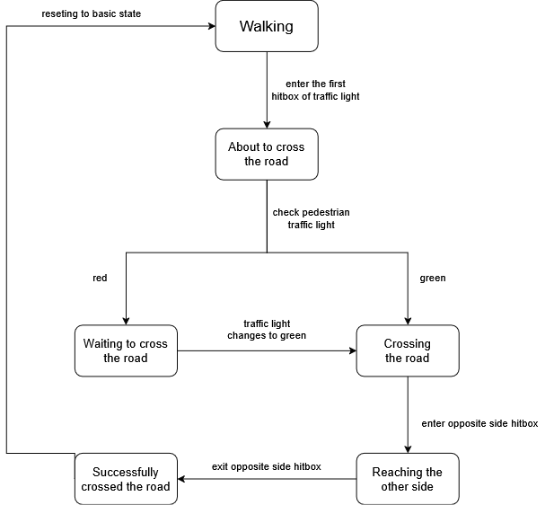

# AI Pedestrians

The pedestrians in the current version, as of November 10th 2025, of the application use the default mannequin models. They use a simple AI Controller, which uses a six state machine, and their goal is to reach a random target point inside the map.

## Actions

These are the main functions of each car in more detail.

### Pedestrian States

The pedestrians use a 6 state machine for their main logic. The 6 states are
1. Walking 
2. About to cross the road
3. Waiting to cross the road
4. Crossing the road
5. Reached opposite side of the road
6. Successfully crossed the road

The Walking state is the default state of the pedestrian AI. It's goal is for the pedestrian to move uninterupted to the target point. However if the pedestrian enters the hitbox of a traffic light, which means they want to cross, the enter the second state "About to cross the road". At that moment a check of the traffic light occurs to determine the next state. If the traffic light is green, they enter the fourth state "Crossing the road". However if it is red, they enter the third state "Waiting to cross the road". After the traffic light turns to green, the pedestrian enters the fourth state. Reaching the hitbox on the opposite side makes the pedestrians enter the fifth state with the same name and after they exit the hitbox, they reach the sixth state "Successfully crossed the road". The final step is reseting back to walking state, which occurs automatically.

### Target Points

There are multiple random points inside the map, which are assigned randomly at the start of the simulation or when a pedestrian reaches one. These serve as the goal of the pedestrians which they try to reach.

## Next steps

These are next addition to the project. Any step that is completed will be struck through ({--example--}).

* {--Custom low poly pedestrian models (currently using some free ones, may stick with them)--}
* More complex movement
* Fix traffic light bugs
* Spawning/despawning for more realism near the player