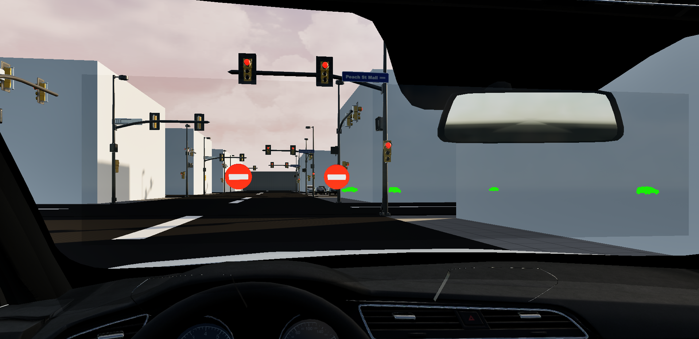
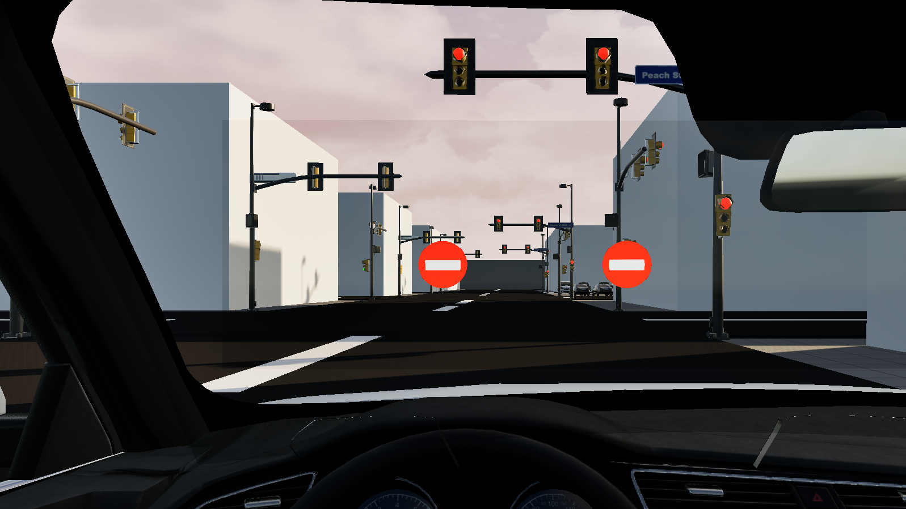
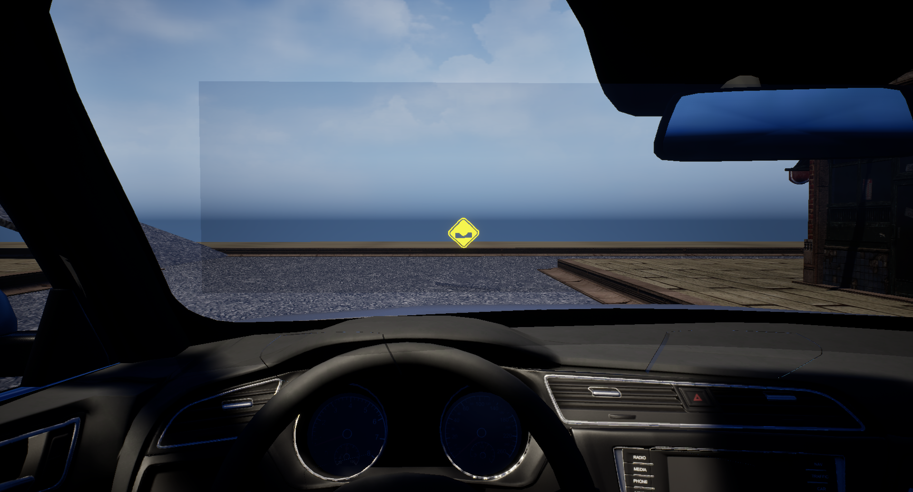
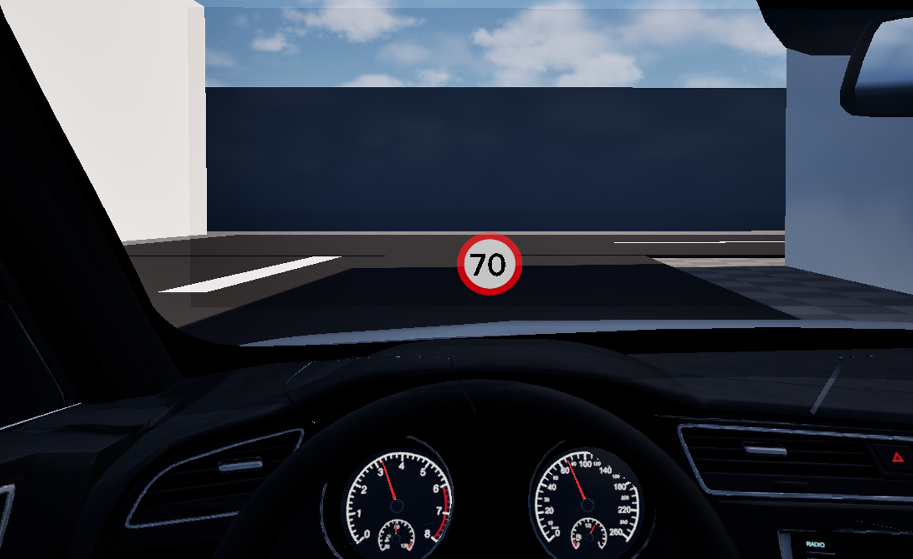

# AR Windshield

This is the main feature of the application. It is a 100x24cm screen in front of the driver which displays important information for the safety of the driver. The feature works in virtual reality (VR) environment and has been tested with HITC Vive headset.

## Display Features

* [AI Cars](ai-cars.md) and Pedestrians
* Traffic Warnings
* Obstacle Warnings

## How it works

This feature works using two different mechanics. It uses [Post Process Materials](https://dev.epicgames.com/documentation/en-us/unreal-engine/post-process-materials-in-unreal-engine) and an object detection function which uses octrees to display visible information for the windshield.
Specifically for the visualization of the danger levels of Cars and Pedestrians only Post Process Materials are needed, which use the depth buffer and Unreal Engine's [Custom Depth Buffer](https://www.tomlooman.com/the-many-uses-of-custom-depth-in-unreal-4/), which is basically a depth buffer only for selected actors in the scene.

## Details

!!! note "AI Cars and Pedestrians"

    The AI Cars and the Pedestrians are explained in more detail on their own page [here](ai-cars.md).

### Traffic Warnings

While driving the user has to pay attention to the traffic laws and to traffic sign indications. Using instances of these signs to inform and warn the driver for potential speed limits, stop warnings or traffic lights. To achieve this an octree containing all the traffic warnings and the obstacle warning, which will be explained in detail in the next segment, is initialized during the start of the simulation. This octree can be updated manually if a warning is deleted or added. 

The position of these warnings is static, so the position of these should be manually placed or spawned using an external server with the information (and potentially websockets). 

### Obstacle Warnings

This part refers mainly to static obstacles, like dips or bumps in the road. Using the same logic as with the traffic warnings, which is that the position of these should be manually places or spawned using an external server with information, they warn the driver about the obstacle and visualize the general area of the obstacle. As an example the dips require a radius of it (or at least an estimate) to visualize it using a circular warning on the ground.

### Exceeding Speed Limit

Using a custom widget, which changes the speed limit text, when a user is exceeding the speed limit of the road there is a small transparent warning displayed above the steering wheel. The speed limits is always updated after a change in the speed limit in a specific road. For example leaving a 30km/h area and entering a 50km/h area, will change the warning text too.

### Customizing View

This feature is still under development. Currently by pressing the equivalent key for each feature the driver can enable and disable the visualization of cars, pedestrians, signs or speeding limit warnings.

## Next steps

These are next addition to the project. Any step that is completed will be struck through ({--example--}).

* {--Fixing position of projected elements on VR--}
* Adding more traffic signs
* Custom traffic signs
* {--Visualization of exceeding speed limit--}
* Connecting with data base

