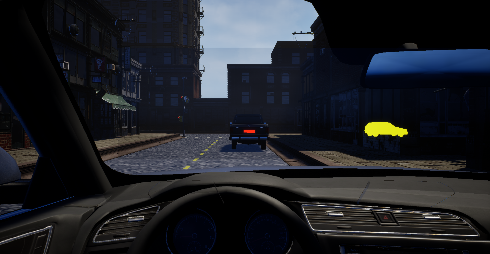
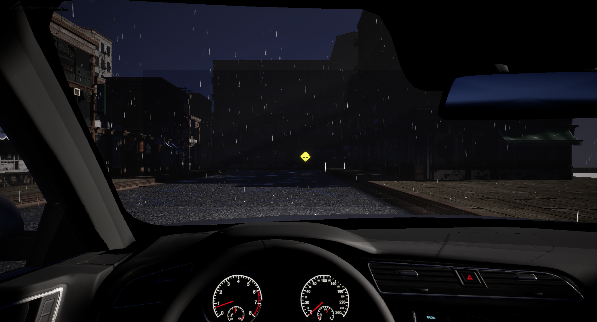

# Weather Implementation

There are different weather environments which can be used in the simulator, which will affect the visibility ranges of warning and obstacles.

## Weather states

* Sunny or cloudy
* Rain using [Easy Rain]() plugin
* Night

## Sunny/cloudy

Both of these are the default state, when the driver has maximum visibility. This uses the default settings (like range or effect or emissiveness) for all of the warnings.
The moving obstacles (cars, pedestrians, etc) are visualized on situations where they are not visible for the driver. For example when they are behind buildings or multiple other cars.

## Rain

Currently this state uses the Easy Rain plugin, which creates rain particles, puddles and generally everything that is needed for a rainy scene's visuals. Visibility is limited, so the settings will be modified for easier driving experience. Currently using the default settings.

## Night

A night driving mode is not included yet, because there is no scene with light sources currently on the simulator. The final demo scene will include lights and night driving. Visibility is also very limited, so the settings of the warnings will be adjusted. Also the car lights will be adjusted to work with very limited light.

## Next Steps

* Rain state settings
* Night mode
* Potentially creating custom rain visuals.
* Potentially other states (snow, no streetlights)

